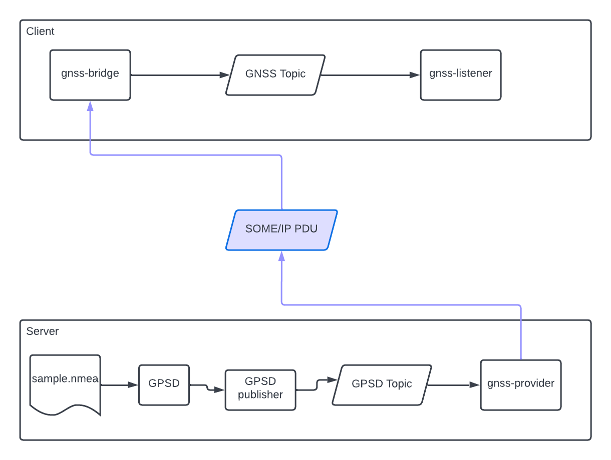

# ROS SOME/IP bridge

Proof of concept project which tries to create a bridge between vsomeip / common-api
and ROS linux environment.

[](https://asciinema.org/a/SOwJOZSkW4m4sPGb8YC5PPK1Z)

# Problem definition

Make SOME/IP data available in ROS2 natively.

## Architecture



* We would use open source SOME/IP stack implementation (COVESA/GENIVI)
* SOME/IP broadcast's published as ROS2 topics.

UDS = Unix Domain Socket (used by GENIVI stack for communication between router and clients on localhost)

### Limitations

We will limit our scope by making available only SOME/IP broadcast messages as topics, with
string messages which contain data in json format.

### Open points

* Parse FIDL/FDEPL files to generate bridge glue code automatically
* Add support for different data types (i.e. ROS topic datatypes)
* Think of potential configuration (mapping between topics and SOME/IP events)
* Think how to handle outgoing data (requests)
* Think how to handle attributes
# How it works

To simulate remote ECU which broadcasts GNSS data over the network using 
UDP packets with SOME/IP serialised payload we would use dedicated docker container `Docker.server`.

At the same time to receive those PDUs we would run another dedicated docker container `Docker.client`.

to run the setup simply execute (tested in ubuntu 20.04):

```bash
    make run
```

to rebuild the contains without running execute:

```bash
    make compose
```

# Development

To simplify compilation and testing of the changes there is possibility
to enter docker container, using:

```bash
    make enter-build-env
```

then you can use shortcuts like

```
    make colcon-build
```

to build all packages in the repository. Or, if you like to build them
separately use

```bash
    make gnss-provider
    make gnss-bridge
    make gnss-someip-lib
    make gnss-listener
```

# Tips

I will put here some tips / tricks to not to forget.
### Cleanup docker networks

```bash
    docker network prune
```

# Links

* https://colcon.readthedocs.io/en/released/user/how-to.html
* https://hub.docker.com/_/ros
* https://docs.ros.org/en/foxy/Tutorials/Composition.html
* https://docs.ros.org/en/foxy/Tutorials/Topics/Understanding-ROS2-Topics.html
* https://docs.ros.org/en/foxy/Tutorials/Understanding-ROS2-Nodes.html
